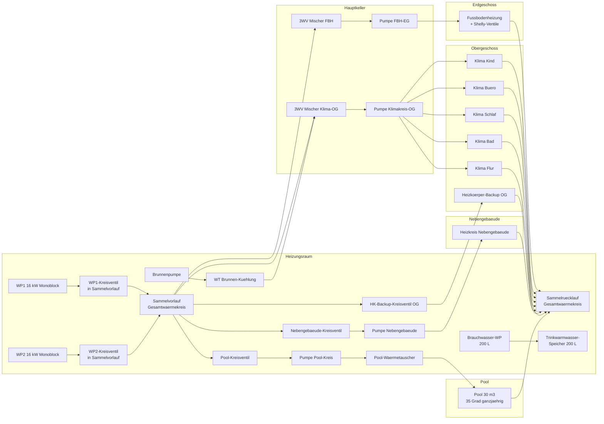

# Hydraulik-Schema (Endausbau)

Grundprinzip: **WP1 und WP2 speisen beide denselben Gesamtwaermekreis**.
Haus, Nebengebaeude, Pool und HK-Backup sind Senken an diesem gemeinsamen
Erzeuger-/Verteilerkreis. Es gibt keine feste Zuordnung "WP1 = Haus" oder
"WP2 = Pool"; jede aktive Waermequelle kann jede aktive Senke bedienen.

## Regelungsprinzip

- **Gesamtwaermekreis**: Alle normalen Heiz-/Pool-Anforderungen werden gesammelt.
  Der hoechste geforderte Vorlauf plus Mischerreserve ergibt den WP-Sollwert.
- **WP1/WP2**: Beide WPs bekommen denselben Sollwert fuer den Sammelvorlauf.
  Bei kleiner Last laeuft eine WP, bei mehreren aktiven Senken oder hoher Last
  laufen beide parallel. Laufzeitrotation wird separat gepflegt.
- **Pool**: Der Pool ist eine Senke am Gesamtwaermekreis. Er wird ueber sein
  Kreisventil und die Pool-Kreis-Pumpe zugeschaltet, nicht ueber eine exklusiv
  zugeordnete Waermepumpe.
- **Nebengebaeude / Haus / HK-Backup**: Ebenfalls Senken am gemeinsamen Kreis.
- **BWWP**: Die Brauchwasser-WP bleibt ein separater kleiner Steuerkreis fuer den
  Trinkwarmwasserspeicher.
- **Brunnen-WT**: Eigener Kuehlpfad in den Klimakreis, getrennt von der
  Waermeerzeugerlogik.

## Wichtige Konsequenz

Software, HA-Visualisierung und Beschriftung muessen immer von Quellen und
Senken sprechen:

- Quellen: `wp1`, `wp2`, spaeter ggf. `oelbrenner`
- Gemeinsamer Knoten: `gesamtwaermekreis`
- Senken: `fbh_eg`, `klima_og`, `nebengeb`, `hk_backup`, `pool`

Damit bleibt die Anlage routingfaehig: **alles kann auf alles geroutet werden**,
solange Ventilstellung, Pumpenfreigabe und Solltemperatur dazu passen.
