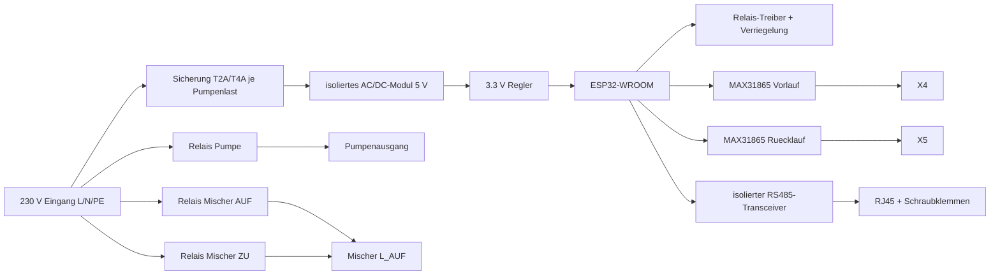

# RS485-Pumpengruppen-Platine

Stand: 2026-06-25

Entwurf fuer eine dezentrale Hutschienen-Platine je Pumpenbaugruppe mit
3-Wege-Mischer, Umwaelzpumpe, Vorlauf- und Ruecklauffuehler. Die Hauptsteuerung
gibt per Modbus RTU nur Pumpenfreigabe und Stellwert-Sollposition vor. Die
Platine berechnet daraus die noetige Mischer-Laufzeit selbst.

Wichtig: Das ist ein Entwurfs- und Layout-Lastenheft, keine fertige
Konformitaetserklaerung. 230-V-Layout, Schutzleiterfuehrung und Einbau muessen
vor Fertigung/Inbetriebnahme von einer Elektrofachkraft geprueft werden.

## Zielbild

- Ein Board pro Heiz-/Kuehlkreis: `fbh_eg`, `klima_og`, `hk_backup`, optional
  spaeter weitere Senken.
- Versorgung je Board direkt aus 230 V AC.
- ESP32 fuer Modbus-RTU-Slave, lokale Laufzeitlogik, WLAN-Konfiguration und OTA.
- Keine Anzeige am Geraet.
- Anschluss an RS485-Bus mit RJ45-Daisychain plus Schraubklemmen fuer YSTY.
- Ausgangslogik:
  - Pumpe AN/AUS
  - Mischer AUF
  - Mischer ZU
- Eingangssensorik:
  - Vorlauf RTD, 2-Draht, PT100/PT1000
  - Ruecklauf RTD, 2-Draht, PT100/PT1000

## Klemmen und Steckverbinder

| Stecker | Typ | Pins | Funktion |
|---|---|---:|---|
| X1 | Schraubklemme 5,08/7,62 mm | 3 | 230 V Eingang: L, N, PE |
| X2 | Schraubklemme 5,08/7,62 mm | 3 | Pumpenausgang: L geschaltet, N, PE |
| X3 | Schraubklemme 5,08/7,62 mm | 4 | Mischer: L_AUF, L_ZU, N, PE |
| X4 | Schraubklemme 3,5 mm | 2 | RTD Vorlauf |
| X5 | Schraubklemme 3,5 mm | 2 | RTD Ruecklauf |
| J1 | RJ45 | 8 | RS485 Bus A/B/GND, parallel zu J2/J3/J4 |
| J2 | RJ45 | 8 | RS485 Bus A/B/GND, parallel zu J1/J3/J4 |
| J3 | Schraubklemme 3,5 mm | 3 | RS485 Eingang YSTY: D+, D-, GND |
| J4 | Schraubklemme 3,5 mm | 3 | RS485 Ausgang YSTY: D+, D-, GND |

RJ45-Pinout:

| RJ45 Pin | Signal |
|---:|---|
| 4 | RS485 D+ |
| 5 | RS485 D- |
| 7 | GND/COM |
| 8 | GND/COM |
| 1,2,3,6 | nicht belegt |

Alle vier RS485-Anschluesse liegen elektrisch parallel. Die beiden RJ45-Buchsen
sind fuer kurze Patchkabel zwischen Pumpengruppen gedacht. Die Schraubklemmen
sind fuer ankommende/weitergehende YSTY-Leitung gedacht.

## Blockschaltbild



## Empfohlene Bauteilklassen

| Funktion | Empfehlung |
|---|---|
| MCU | ESP32-WROOM-32U oder vergleichbares ESP32-Modul mit externer Antenne |
| 230 V -> 5 V | zugelassenes AC/DC-Modul, z.B. Mean Well IRM-05-5 oder RAC05-05SK/277 |
| 3.3 V | Buck/LDO mit Reserve fuer WLAN-Spitzenstrom, mindestens 600 mA Peak |
| RS485 | isoliert, z.B. ISO1410 + isolierter DC/DC oder ADM2587E-Klasse |
| RTD | 2x MAX31865 oder gleichwertig, je Kanal eigener Praezisionsreferenzwiderstand |
| Relais | 3x 250 V AC, passend zur Pumpenlast/Inrush; fuer Pumpenausgang 16-A-Klasse bevorzugen |
| Relais-Treiber | Low-Side-Treiber mit Freilaufpfad; Relais-Spulen aus 5 V oder 12 V Hilfsspannung |
| Eingangsschutz RTD | Serienwiderstand, RC-Filter, ESD/Surge nach Leitungslage |
| Bus-Schutz | TVS fuer D+/D-/GND, optional GDT/CMC bei langen Leitungen |

PT1000 ist fuer 2-Draht-Fuehler bevorzugt, weil Leitungswiderstand weniger stark
ins Messergebnis eingeht. PT100 wird unterstuetzt, sollte aber als
Konfigurationsvariante mit Offset-Kalibrierung behandelt werden.

## 230-V-Ausgaenge

Die Platine schaltet nur die Phase:

- Pumpenausgang X2:
  - `L_Pumpe` ueber Relais K1
  - `N` durchverbunden
  - `PE` durchverbunden
- Mischerausgang X3:
  - `L_AUF` ueber Relais K2
  - `L_ZU` ueber Relais K3
  - `N` durchverbunden
  - `PE` durchverbunden

K2 und K3 muessen doppelt gesichert sein:

- Software-Interlock: nie AUF und ZU gleichzeitig aktiv.
- Hardware-Interlock im Treiber, z.B. gegenseitiges Sperren der Treiberstufen
  oder zwangsgefuehrte Logik, damit ein Firmwarefehler nicht beide Relais
  gleichzeitig anziehen kann.
- Umschaltpause zwischen AUF/ZU mindestens 500 ms.

Empfohlen: RC-Snubber oder MOV je induktiver Last nach konkreter Pumpen- und
Stellantriebs-Spezifikation. Fuer Pumpen mit hoher Einschaltspitze Relais nicht
nach Nennstrom allein auswaehlen, sondern nach Inrush-/Motorlast-Datenblatt.

## Leiterplatte und Sicherheitsabstaende

Auslegung fuer 230 V AC, Schaltschrank-/Gebaeudetechnik, Verschmutzungsgrad 2.
Wenn das Board in einer Umgebung nach Ueberspannungskategorie III bewertet wird,
sind die strengeren Werte anzusetzen.

Layout-Ziele:

- Mindestens 8 mm Abstand/Kriechstrecke zwischen primaerer 230-V-Seite und SELV
  inklusive ESP32, RS485, RTD und USB/UART-Servicepunkten.
- Fraesnut oder breite Keepout-Zone zwischen 230-V- und SELV-Seite, besonders
  am AC/DC-Modul, Relaiskontaktbereich und unter Steckverbindern.
- Mindestens 3 mm Abstand zwischen 230-V-Leitern unterschiedlicher Potentiale
  auf der Lastseite; bei Netz-Eingang/ungefilterter Seite konservativ groesser.
- PE nicht als duenne Leiterbahn durch das Board fuehren. Bevorzugt:
  grossflaechige, kurze PE-Fuehrung mit ausreichender Kupferbreite oder
  externe PE-Brueckung/Klemmenblock im Gehaeuse.
- Keine SELV-Leitung unter Relaiskontakten, Netzsicherung, MOVs oder
  230-V-Klemmen hindurch.
- Silkscreen-Zonierung: `230 V` und `SELV` klar markieren.
- Testpunkte fuer 230 V nur beruehrgeschuetzt oder ganz weglassen.
- Leiterbahnbreite fuer Pumpenphase nach realem Strom, Kupferdicke und
  Temperaturhub dimensionieren; fuer 5 A Dauerstrom auf 35 um Kupfer nicht unter
  ca. 3 mm planen, fuer mehr Strom 70 um Kupfer oder deutlich breitere Flaechen.
- Sicherung vor den Relaiskontakten vorsehen; Wert nach Leitungsschutz,
  Klemmenrating und Pumpenlast festlegen.
- DRC-Regeln im CAD getrennt fuer Netze `MAINS_L/N`, `MAINS_SW`, `PE`, `SELV`,
  `RS485_ISO` anlegen.

Vor Fertigung zu pruefen:

- EN 60664-1 fuer Isolationskoordination/Kriechstrecken.
- DIN EN 60730-1, falls die Baugruppe als automatische elektrische Regel- und
  Steuergeraete-Baugruppe bewertet wird.
- DIN VDE 0100 / Schaltschranknormen fuer Einbau, Absicherung, PE und
  Leitungsquerschnitte.
- EMV-Anforderungen, insbesondere lange RS485-/RTD-Leitungen und Relaislasten.

## Firmware-Funktionen

Die Platine ist ein Modbus-RTU-Slave. WLAN wird nur fuer Konfiguration,
Diagnose und OTA genutzt, nicht fuer den regulaeren Regelbetrieb.

Pflichtfunktionen:

- Slave-Adresse, Baudrate, Paritaet, Mischerlaufzeit und Sensortyp per WLAN
  konfigurierbar.
- OTA-Update per WLAN, abgesichert mit Passwort/Token.
- Watchdog: bei Modbus-Kommunikationsausfall Pumpe aus nach Timeout; Mischer
  bleibt stehen.
- Lokale Relaislogik laeuft auch bei WLAN-Ausfall weiter.
- Aktuelle Mischerposition wird in NVS/Flash persistiert, aber mit begrenzter
  Schreibfrequenz.
- Kalibrierfahrt konfigurierbar:
  - `close_to_zero`: ZU fuer Laufzeit + Ueberlauf, Position = 0 %.
  - `open_to_hundred`: AUF fuer Laufzeit + Ueberlauf, Position = 100 %.
  - `none`: letzte gespeicherte Position verwenden.
- Endlagen-Rekalibrierung: bei Sollwert 0 % oder 100 % darf mit kleinem
  Ueberlauf gefahren werden, um Laufzeitfehler zu korrigieren.
- Temperatur-Plausibilitaet: z.B. -20..95 C fuer Heizkreise.

Stellweg-Berechnung:

```text
delta_pct = ziel_pct - position_pct
laufzeit_s = abs(delta_pct) / 100 * kalibrierte_gesamtlaufzeit_s
richtung = AUF wenn delta_pct > 0, sonst ZU
```

Waehrend der Fahrt wird die interne Position ueber die vergangene Zeit
integriert. Nach Ablauf wird das Relais abgeschaltet und die erreichte Position
als Istwert gemeldet.

## Modbus-Registervorschlag

Alle Prozentwerte werden mit Faktor 10 uebertragen: 56,0 % = `560`.
Temperaturen werden mit Faktor 10 uebertragen: 34,5 C = `345`.

Holding Register, Master -> Board:

| Adresse | Name | Einheit | Beschreibung |
|---:|---|---|---|
| 0 | `command_seq` | - | Wird bei neuem Befehl erhoeht |
| 1 | `pump_enable` | 0/1 | Pumpe aus/an |
| 2 | `mixer_target_pct_x10` | 0..1000 | Zielposition |
| 3 | `mode` | enum | 0 auto, 1 hand, 2 kalibrieren_zu, 3 kalibrieren_auf |
| 4 | `watchdog_timeout_s` | s | Default 60 |
| 5 | `mixer_runtime_s` | s | Kalibrierte 0..100-%-Laufzeit |
| 6 | `endstop_overrun_s` | s | Zusatzlauf an Endlage |
| 7 | `rtd_type` | enum | 0 PT1000, 1 PT100 |
| 8 | `failsafe_pump` | 0/1 | Pumpenzustand bei Busausfall, Default 0 |

Input Register, Board -> Master:

| Adresse | Name | Einheit | Beschreibung |
|---:|---|---|---|
| 0 | `status_bits` | bitfield | online, fault, moving, pump_on, open_on, close_on |
| 1 | `mixer_position_pct_x10` | 0..1000 | geschaetzte Istposition |
| 2 | `vl_temp_c_x10` | C | Vorlauf |
| 3 | `rl_temp_c_x10` | C | Ruecklauf |
| 4 | `last_command_seq` | - | zuletzt uebernommener Befehl |
| 5 | `fault_code` | enum | 0 ok, siehe Fehlerliste |
| 6 | `uptime_s_lo` | s | Uptime low word |
| 7 | `uptime_s_hi` | s | Uptime high word |
| 8 | `fw_version` | BCD | z.B. 0x0100 |

Fehlercodes:

| Code | Bedeutung | Reaktion |
|---:|---|---|
| 0 | ok | normal |
| 1 | Modbus-Watchdog abgelaufen | Pumpe nach Timeout aus, Mischer stop |
| 2 | VL-Fuehler unplausibel/defekt | Fehler melden, Regelung Master entscheidet |
| 3 | RL-Fuehler unplausibel/defekt | Fehler melden, Regelung Master entscheidet |
| 4 | beide Mischerrelais angefordert | beide aus, fault |
| 5 | Kalibrierung fehlt | Mischerbefehle optional sperren |
| 6 | Relais-/Treiberdiagnose fehlerhaft | alle Ausgaenge aus |

## Adressierung und Bus

Vorgeschlagene Slave-IDs:

| Slave-ID | Kreis |
|---:|---|
| 30 | FBH EG Pumpengruppe |
| 31 | Klima OG Pumpengruppe |
| 32 | HK-Backup OG Pumpengruppe |
| 33..39 | Reserve |

Busparameter Startwert: 19200 8E1 oder 9600 8N1. Fuer maximale Robustheit mit
langen YSTY-Strecken ist 9600 8N1 unkritischer; final muss die Hauptsteuerung
einheitlich konfiguriert werden.

Hardware:

- 120-Ohm-Abschluss per Jumper/DIP nur am letzten Busgeraet.
- Umsetzung im KiCad-Entwurf: `R3 = 120R` plus `JP1 RS485_TERM_ON`; Jumper
  offen = kein Abschluss, Jumper geschlossen = Abschluss zwischen D+ und D-.
- Bias-Widerstaende nur einmal pro Bus aktivieren, bevorzugt am Master/Gateway.
- RJ45 und Schraubklemmen duerfen nicht als Stern verdrahtet werden; sie sind
  nur mechanische Alternativen fuer dieselbe Linien-Topologie.

## Mechanik

- Hutschienen-Gehaeuse, z.B. 4 TE bis 6 TE je nach Klemmen- und Relaisgroesse.
- 230-V-Klemmen auf einer Seite, SELV/RS485/RTD auf der anderen Seite.
- ESP32-Antenne weg von Relais, Netzteil, PE-Flachen und Schaltschrankwand.
- Beschriftung je Klemme direkt auf Front/Deckel: `L N PE`, `Pumpe`, `AUF ZU N PE`,
  `VL`, `RL`, `RS485`.
- Service-Taste fuer WLAN-Konfigurationsmodus und Status-LED im SELV-Bereich
  sind sinnvoll, aber kein Display erforderlich.
- USB-C-Serviceanschluss auf SELV-Seite fuer Firmware/Debug. Bei klassischem
  ESP32-WROOM ist dafuer ein USB-UART-Baustein noetig; D+/D- duerfen nicht
  direkt an den ESP32-WROOM gehen.
- ESP-Antenne extern ausfuehren, z.B. ESP32-WROOM-32U mit U.FL-Pigtail zur
  Antenne ausserhalb der Platine/des Schaltschrankbereichs.

## Offene Entscheidungen vor KiCad

- Pumpenleistung und Einschaltstrom der konkreten Pumpenbaugruppen.
- Laufzeit der konkreten 3WV-Stellantriebe von 0..100 %.
- PT100 oder PT1000 final; Empfehlung: PT1000.
- Ob der Mischer-Stellantrieb wirklich 230 V AUF/ZU mit gemeinsamem N ist.
- Gehaeusebreite und bevorzugte Klemmenserie.
- Konkreter USB-UART-Baustein und Auto-Boot-Schaltung fuer ESP32-Flashing.

## Quellen und Pruefhinweise

- IEC 60664-1:2020 ist die Basis fuer Isolationskoordination an Geraeten bis
  AC 1000 V / DC 1500 V und fuer die Bestimmung von Luft- und Kriechstrecken.
- IEC 60730-1:2022 beschreibt Anforderungen an Konstruktion, Betrieb und Test
  automatischer elektrischer Steuergeraete.
- IPC-2221B ist der generische Leiterplatten-Designstandard und Grundlage fuer
  Leiterbahn-/Abstands- und Fertigungsregeln; konkrete Stromtragfaehigkeit muss
  mit Kupferdicke, Temperaturhub und Leiterplattenhersteller abgestimmt werden.
- Vereinfachte Online-Rechner fuer Leiterbahnbreite sind nur Vorab-Schaetzung,
  keine finale Sicherheitsvalidierung.
